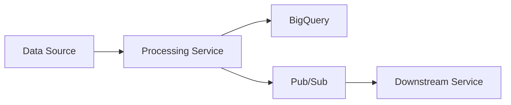

# Project Name

Brief description of what this data engineering project does and its purpose.

## Architecture Overview



## Features

- **Data Processing**: Transforms raw data into structured format
- **Real-time Streaming**: Processes data in near real-time using Pub/Sub
- **Monitoring**: Comprehensive logging and metrics
- **Reliability**: Built-in retry logic and error handling

## Tech Stack

- **Runtime**: Python 3.11, Cloud Run
- **Data**: BigQuery, Pub/Sub
- **Infrastructure**: Terraform, Docker
- **Monitoring**: Cloud Logging, Cloud Monitoring

## Quick Start

### Prerequisites
- Python 3.11+
- Docker
- GCP account with appropriate permissions

### Local Development

1. **Clone and setup**:
   ```bash
   git clone <repo-url>
   cd project-name
   cp .env.example .env  # Edit with your values
   ```

2. **Install dependencies**:
   ```bash
   pip install -r requirements.txt
   ```

3. **Run locally**:
   ```bash
   python src/main.py
   ```

4. **Run with Docker**:
   ```bash
   docker-compose up --build
   ```

### Testing

```bash
# Unit tests
pytest tests/unit/

# Integration tests  
pytest tests/integration/

# All tests with coverage
pytest --cov=src tests/
```

## Configuration

Key environment variables (see `.env.example`):

| Variable | Description | Example |
|----------|-------------|---------|
| `GCP_PROJECT_ID` | GCP project identifier | `my-project-123` |
| `BIGQUERY_DATASET` | BigQuery dataset name | `analytics_data` |
| `PUBSUB_TOPIC` | Pub/Sub topic for output | `processed-events` |
| `LOG_LEVEL` | Logging level | `INFO` |

## Deployment

### Cloud Run Deployment

```bash
# Build and deploy
./scripts/deploy.sh production

# Or manually:
gcloud run deploy my-service \\
  --source . \\
  --region us-central1 \\
  --set-env-vars GCP_PROJECT_ID=my-project
```

### Infrastructure

Deploy infrastructure using Terraform:

```bash
cd infrastructure/terraform
terraform init
terraform plan
terraform apply
```

## API Endpoints

| Endpoint | Method | Description |
|----------|--------|-------------|
| `/healthz` | GET | Health check |
| `/ready` | GET | Readiness check |
| `/process` | POST | Trigger data processing |

## Monitoring & Troubleshooting

### Key Metrics
- `processed_records_total`: Total records processed
- `processing_duration_seconds`: Processing time histogram
- `errors_total`: Error count by type

### Common Issues

**Issue**: Processing failures
- **Cause**: Invalid input schema
- **Solution**: Check logs for validation errors, verify input format

**Issue**: High memory usage  
- **Cause**: Large batch sizes
- **Solution**: Reduce batch size in configuration

### Logs

View logs in Cloud Logging:
```bash
gcloud logs read "resource.type=cloud_run_revision" --limit 50
```

## Development

### Code Style
- Follow PEP 8 for Python
- Use type hints
- Run `black` for formatting
- Use `ruff` for linting

### Contributing
1. Create feature branch
2. Make changes with tests
3. Run tests and linting
4. Submit PR with description

### Project Structure
See [project-structure-template.md](./project-structure-template.md) for detailed file organization.

## License

[Your License Here]

## Support

For issues and questions:
- Create GitHub issue
- Check [troubleshooting docs](./docs/troubleshooting.md)
- Review [architecture docs](./docs/architecture.md)